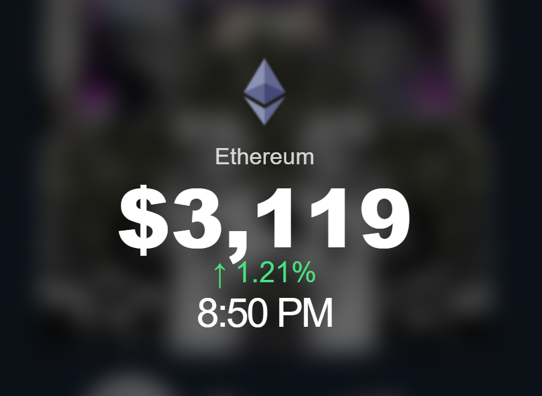
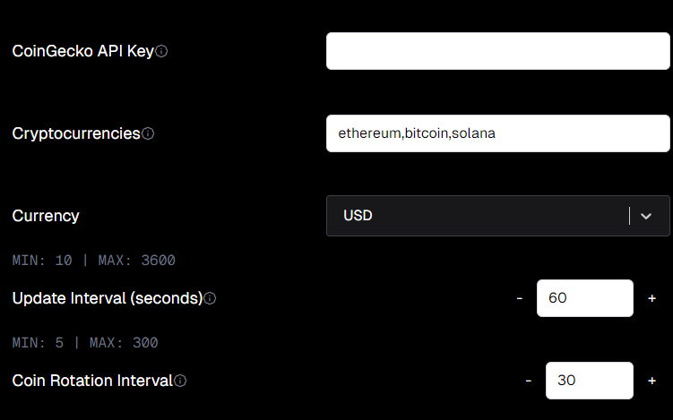

# DeskThing Crypto Tracker

DeskThing Crypto Tracker allows you to **track the prices of various cryptocurrencies** of your choosing directly in DeskThing. The app will **cycle through the cryptocurrencies** you select, so you can monitor multiple coins effortlessly.

## Features

- Track multiple cryptocurrencies simultaneously
- Cycle through your selected coins automatically
- Real-time price updates
- Simple and intuitive interface
- Works seamlessly within DeskThing
- **Optional:** You can use a CoinGecko API key for additional features (not implemented yet)

## Settings

Pick the cryptocurrencies you want to track in the settings:

## Usage

1. Open DeskThing Crypto Tracker.
2. Go to the settings and select the cryptocurrencies you want to track.
3. Watch as the app cycles through your chosen coins with real-time price updates.
4. (Optional) Add a CoinGecko API key in the settings to unlock extra features in the future.
